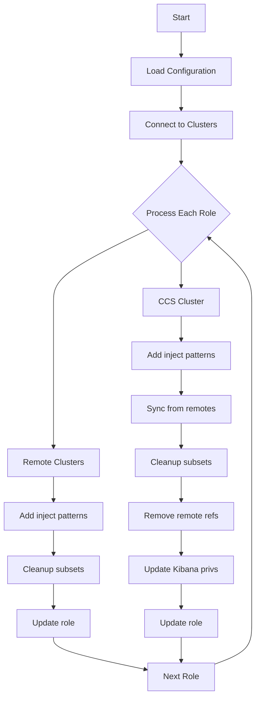
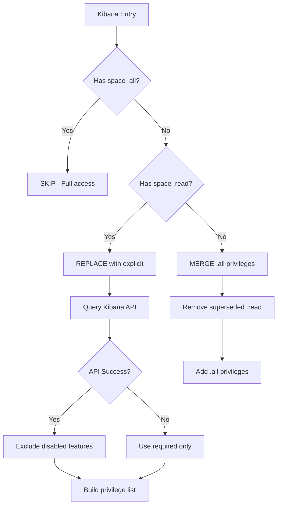
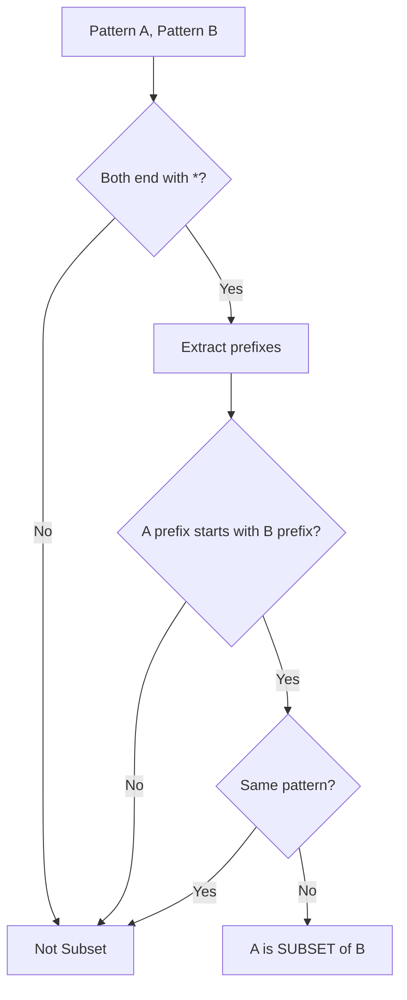

# Workflow Diagrams

Visual representation of the Elasticsearch Role Auto-Updater workflow.

## High-Level Architecture

```
┌─────────────────────────────────────────────────────────────────────────────┐
│                         ELASTICSEARCH ROLE AUTO-UPDATER                     │
└─────────────────────────────────────────────────────────────────────────────┘
                                      │
                                      ▼
┌─────────────────────────────────────────────────────────────────────────────┐
│                              CONFIGURATION                                  │
│  ┌─────────────────┐  ┌─────────────────┐  ┌─────────────────┐              │
│  │ Remote Clusters │  │   CCS Cluster   │  │ Inject Patterns │              │
│  │  • prod         │  │  • url          │  │  • partial-*    │              │
│  │  • qa           │  │  • kibana_url   │  │  • restored-*   │              │
│  │  • dev          │  │  • api_key      │  │  • elastic-*    │              │
│  └─────────────────┘  └─────────────────┘  └─────────────────┘              │
└─────────────────────────────────────────────────────────────────────────────┘
                                      │
                    ┌─────────────────┴─────────────────┐
                    ▼                                   ▼
┌───────────────────────────────┐     ┌───────────────────────────────────────┐
│       REMOTE CLUSTERS         │     │            CCS CLUSTER                │
│                               │     │                                       │
│  1. Add inject patterns       │     │  1. Add inject patterns               │
│  2. Cleanup subset patterns   │     │  2. Sync patterns from remotes        │
│  3. Update via API            │     │  3. Cleanup subset patterns           │
│                               │     │  4. Remove remote patterns            │
│                               │     │  5. Update Kibana privileges          │
│                               │     │  6. Update via API                    │
└───────────────────────────────┘     └───────────────────────────────────────┘
```

## Remote Cluster Update Flow

```
┌──────────────────────────────────────────────────────────────────┐
│                    REMOTE CLUSTER UPDATE FLOW                    │
└──────────────────────────────────────────────────────────────────┘

                         ┌─────────────┐
                         │  Get Role   │
                         └──────┬──────┘
                                │
                                ▼
                    ┌───────────────────────┐
                    │  Current Index Names  │
                    │  ┌─────────────────┐  │
                    │  │ filebeat-*      │  │
                    │  │ metricbeat-*    │  │
                    │  │ apm-*           │  │
                    │  │ apm*            │  │
                    │  └─────────────────┘  │
                    └───────────┬───────────┘
                                │
                                ▼
                ┌───────────────────────────────┐
                │  STEP 1: Add Inject Patterns  │
                │  + partial-*                  │
                │  + restored-*                 │
                └───────────────┬───────────────┘
                                │
                                ▼
                    ┌───────────────────────┐
                    │  After Injection      │
                    │  ┌─────────────────┐  │
                    │  │ filebeat-*      │  │
                    │  │ metricbeat-*    │  │
                    │  │ apm-*           │  │
                    │  │ apm*            │  │
                    │  │ partial-*       │◄─┼── NEW
                    │  │ restored-*      │◄─┼── NEW
                    │  └─────────────────┘  │
                    └───────────┬───────────┘
                                │
                                ▼
              ┌─────────────────────────────────┐
              │ STEP 2: Cleanup Subset Patterns │
              │                                 │
              │  apm-* is subset of apm*        │
              │  → Remove apm-*                 │
              └───────────────┬─────────────────┘
                              │
                              ▼
                    ┌───────────────────────┐
                    │  Final Patterns       │
                    │  ┌─────────────────┐  │
                    │  │ filebeat-*      │  │
                    │  │ metricbeat-*    │  │
                    │  │ apm*            │  │  (apm-* removed)
                    │  │ partial-*       │  │
                    │  │ restored-*      │  │
                    │  └─────────────────┘  │
                    └───────────┬───────────┘
                                │
                                ▼
                    ┌───────────────────────┐
                    │  STEP 3: Update Role  │
                    │  PUT /_security/role  │
                    └───────────────────────┘
```

## CCS Cluster Update Flow

```
┌──────────────────────────────────────────────────────────────────┐
│                     CCS CLUSTER UPDATE FLOW                      │
└──────────────────────────────────────────────────────────────────┘

                         ┌─────────────┐
                         │  Get Role   │
                         └──────┬──────┘
                                │
                                ▼
                    ┌───────────────────────┐
                    │  Current Index Names  │
                    │  ┌─────────────────┐  │
                    │  │ filebeat-*      │  │
                    │  │ prod:filebeat-* │  │
                    │  │ qa:metricbeat-* │  │
                    │  │ *:logs-*        │  │
                    │  └─────────────────┘  │
                    └───────────┬───────────┘
                                │
                ┌───────────────┴───────────────┐
                ▼                               ▼
┌───────────────────────────┐   ┌───────────────────────────────┐
│  Remote Cluster Patterns  │   │  STEP 1: Add Inject Patterns  │
│  ┌─────────────────────┐  │   │  + partial-*                  │
│  │ prod: filebeat-*    │  │   │  + restored-*                 │
│  │       metricbeat-*  │  │   │  + elastic-cloud-logs-*       │
│  │       apm-*         │  │   └───────────────┬───────────────┘
│  │                     │  │                   │
│  │ qa:   filebeat-*    │  │                   │
│  │       metricbeat-*  │  │                   │
│  └─────────────────────┘  │                   │
└───────────────┬───────────┘                   │
                │                               │
                └───────────────┬───────────────┘
                                │
                                ▼
              ┌─────────────────────────────────┐
              │  STEP 2: Sync Remote Patterns   │
              │  + metricbeat-* (from remotes)  │
              │  + apm-* (from prod)            │
              └───────────────┬─────────────────┘
                              │
                              ▼
                    ┌───────────────────────┐
                    │  After Sync           │
                    │  ┌─────────────────┐  │
                    │  │ filebeat-*      │  │
                    │  │ metricbeat-*    │◄─┼── SYNCED
                    │  │ apm-*           │◄─┼── SYNCED
                    │  │ partial-*       │  │
                    │  │ restored-*      │  │
                    │  │ elastic-cloud-* │  │
                    │  │ prod:filebeat-* │  │
                    │  │ qa:metricbeat-* │  │
                    │  │ *:logs-*        │  │
                    │  └─────────────────┘  │
                    └───────────┬───────────┘
                                │
                                ▼
              ┌─────────────────────────────────┐
              │ STEP 3: Cleanup Subset Patterns │
              │ (No subsets in this example)    │
              └───────────────┬─────────────────┘
                              │
                              ▼
              ┌─────────────────────────────────┐
              │  STEP 4: Remove Remote Patterns │
              │                                 │
              │  prod:filebeat-* → filebeat-*   │
              │    exists locally → REMOVE      │
              │                                 │
              │  qa:metricbeat-* → metricbeat-* │
              │    exists locally → REMOVE      │
              │                                 │
              │  *:logs-* → logs-*              │
              │    NOT local → KEEP             │
              └───────────────┬─────────────────┘
                              │
                              ▼
                    ┌───────────────────────┐
                    │  After Remote Cleanup │
                    │  ┌─────────────────┐  │
                    │  │ filebeat-*      │  │
                    │  │ metricbeat-*    │  │
                    │  │ apm-*           │  │
                    │  │ partial-*       │  │
                    │  │ restored-*      │  │
                    │  │ elastic-cloud-* │  │
                    │  │ *:logs-*        │  │  ← KEPT
                    │  └─────────────────┘  │
                    └───────────┬───────────┘
                                │
                                ▼
              ┌─────────────────────────────────┐
              │  STEP 5: Update Kibana Privs    │
              │  (See Kibana Flow Below)        │
              └───────────────┬─────────────────┘
                              │
                              ▼
                    ┌───────────────────────┐
                    │  STEP 6: Update Role  │
                    │  PUT /_security/role  │
                    └───────────────────────┘
```

## Kibana Privilege Update Flow

```
┌──────────────────────────────────────────────────────────────────┐
│                   KIBANA PRIVILEGE UPDATE FLOW                   │
└──────────────────────────────────────────────────────────────────┘

                    ┌───────────────────────┐
                    │  Current Kibana Apps  │
                    └───────────┬───────────┘
                                │
        ┌───────────────────────┼───────────────────────┐
        │                       │                       │
        ▼                       ▼                       ▼
┌───────────────┐       ┌───────────────┐       ┌───────────────┐
│   Entry 1     │       │   Entry 2     │       │   Entry 3     │
│ space:admin   │       │ space:users   │       │ space:viewer  │
│ ┌───────────┐ │       │ ┌───────────┐ │       │ ┌───────────┐ │
│ │ space_all │ │       │ │ space_read│ │       │ │ discover  │ │
│ └───────────┘ │       │ └───────────┘ │       │ │   .read   │ │
└───────┬───────┘       └───────┬───────┘       │ │ dashboard │ │
        │                       │               │ │   .read   │ │
        ▼                       ▼               │ └───────────┘ │
┌───────────────┐       ┌───────────────┐       └───────┬───────┘
│    SKIP       │       │   REPLACE     │               │
│ (full access) │       │  space_read   │               ▼
└───────────────┘       │  with explicit│       ┌───────────────┐
                        │  privileges   │       │    MERGE      │
                        └───────┬───────┘       │  Add .all     │
                                │               │  Remove .read │
                                ▼               └───────┬───────┘
                        ┌───────────────┐               │
                        │ Query Kibana  │               │
                        │ Spaces API    │               │
                        │ for disabled  │               │
                        │ features      │               │
                        └───────┬───────┘               │
                                │                       │
                                ▼                       ▼
                        ┌───────────────┐       ┌───────────────┐
                        │   Result      │       │   Result      │
                        │ ┌───────────┐ │       │ ┌───────────┐ │
                        │ │ discover  │ │       │ │ discover  │ │
                        │ │   .all    │ │       │ │   .all    │ │
                        │ │ dashboard │ │       │ │ dashboard │ │
                        │ │   .all    │ │       │ │   .all    │ │
                        │ │ visualize │ │       │ │ visualize │ │
                        │ │   .all    │ │       │ │   .all    │ │
                        │ │ canvas    │ │       │ └───────────┘ │
                        │ │   .read   │ │       └───────────────┘
                        │ │ maps.read │ │
                        │ │ ml.read   │ │
                        │ │ ...       │ │
                        │ └───────────┘ │
                        └───────────────┘
```

## Subset Pattern Detection Logic

```
┌──────────────────────────────────────────────────────────────────┐
│                  SUBSET PATTERN DETECTION LOGIC                  │
└──────────────────────────────────────────────────────────────────┘

  Pattern A: "apm-*"              Pattern B: "apm*"
       │                               │
       ▼                               ▼
  ┌─────────┐                    ┌─────────┐
  │ Remove  │                    │ Remove  │
  │   '*'   │                    │   '*'   │
  └────┬────┘                    └────┬────┘
       │                               │
       ▼                               ▼
  Prefix: "apm-"                 Prefix: "apm"
       │                               │
       └───────────┬───────────────────┘
                   │
                   ▼
         ┌─────────────────────┐
         │ Does "apm-" start   │
         │ with "apm"?         │
         └──────────┬──────────┘
                    │
              ┌─────┴─────┐
              │    YES    │
              └─────┬─────┘
                    │
                    ▼
         ┌─────────────────────┐
         │  "apm-*" is SUBSET  │
         │  of "apm*"          │
         │                     │
         │  → Remove "apm-*"   │
         └─────────────────────┘


  Examples:
  ┌─────────────────────────┬──────────────────┬─────────────────┐
  │ Candidate               │ Potential Super  │ Is Subset?      │
  ├─────────────────────────┼──────────────────┼─────────────────┤
  │ apm-*                   │ apm*             │ YES (apm- > apm)│
  │ partial-restored-*      │ partial-*        │ YES             │
  │ restored-filebeat-*     │ restored-*       │ YES             │
  │ filebeat-7*             │ filebeat-*       │ YES             │
  │ logs-*                  │ filebeat-*       │ NO              │
  │ apm*                    │ apm-*            │ NO              │
  └─────────────────────────┴──────────────────┴─────────────────┘
```

## Remote Pattern Removal Logic

```
┌──────────────────────────────────────────────────────────────────┐
│                  REMOTE PATTERN REMOVAL LOGIC                    │
└──────────────────────────────────────────────────────────────────┘

  Remote Pattern: "prod:filebeat-*"
                         │
                         ▼
              ┌─────────────────────┐
              │ Extract base pattern│
              │ "filebeat-*"        │
              └──────────┬──────────┘
                         │
                         ▼
              ┌─────────────────────┐
              │ Check local patterns│
              │ ┌─────────────────┐ │
              │ │ filebeat-*      │ │ ← MATCH!
              │ │ partial-*       │ │
              │ │ restored-*      │ │
              │ └─────────────────┘ │
              └──────────┬──────────┘
                         │
                   ┌─────┴─────┐
                   │   MATCH   │
                   └─────┬─────┘
                         │
                         ▼
              ┌─────────────────────┐
              │ REMOVE remote       │
              │ "prod:filebeat-*"   │
              └─────────────────────┘


  Remote Pattern: "prod:partial-restored-*"
                         │
                         ▼
              ┌─────────────────────┐
              │ Extract base pattern│
              │ "partial-restored-*"│
              └──────────┬──────────┘
                         │
                         ▼
              ┌─────────────────────┐
              │ Check local patterns│
              │ ┌─────────────────┐ │
              │ │ filebeat-*      │ │
              │ │ partial-*       │ │ ← SUPERSET!
              │ │ restored-*      │ │
              │ └─────────────────┘ │
              └──────────┬──────────┘
                         │
                   ┌─────┴─────┐
                   │  COVERED  │
                   │ (subset)  │
                   └─────┬─────┘
                         │
                         ▼
              ┌─────────────────────┐
              │ REMOVE remote       │
              │ "prod:partial-*"    │
              └─────────────────────┘


  Remote Pattern: "*:logs-*"
                         │
                         ▼
              ┌─────────────────────┐
              │ Extract base pattern│
              │ "logs-*"            │
              └──────────┬──────────┘
                         │
                         ▼
              ┌─────────────────────┐
              │ Check local patterns│
              │ ┌─────────────────┐ │
              │ │ filebeat-*      │ │
              │ │ partial-*       │ │
              │ │ restored-*      │ │
              │ └─────────────────┘ │
              └──────────┬──────────┘
                         │
                   ┌─────┴─────┐
                   │ NO MATCH  │
                   └─────┬─────┘
                         │
                         ▼
              ┌─────────────────────┐
              │ KEEP remote         │
              │ "*:logs-*"          │
              └─────────────────────┘
```

## Complete Role Update Decision Tree

```
┌──────────────────────────────────────────────────────────────────┐
│                    ROLE UPDATE DECISION TREE                     │
└──────────────────────────────────────────────────────────────────┘

                         ┌─────────────┐
                         │  Get Role   │
                         └──────┬──────┘
                                │
                                ▼
                    ┌───────────────────────┐
                    │ Is role reserved?     │
                    └───────────┬───────────┘
                                │
                ┌───────────────┴───────────────┐
                │ YES                           │ NO
                ▼                               ▼
        ┌───────────────┐              ┌───────────────┐
        │ SKIP role     │              │ Continue      │
        └───────────────┘              └───────┬───────┘
                                               │
                                               ▼
                                   ┌───────────────────────┐
                                   │ Which cluster type?   │
                                   └───────────┬───────────┘
                                               │
                        ┌──────────────────────┴──────────────────────┐
                        │ REMOTE                                      │ CCS
                        ▼                                             ▼
            ┌───────────────────────┐                    ┌───────────────────────┐
            │ 1. Add inject patterns│                    │ 1. Add inject patterns│
            │ 2. Cleanup subsets    │                    │ 2. Sync from remotes  │
            │ 3. Update role        │                    │ 3. Cleanup subsets    │
            └───────────────────────┘                    │ 4. Remove remotes     │
                                                         │ 5. Update Kibana      │
                                                         │ 6. Update role        │
                                                         └───────────────────────┘
```

## Mermaid Diagrams

For tools that support Mermaid, here are equivalent diagrams:

### Main Flow



### Kibana Privilege Decision



### Pattern Subset Detection


